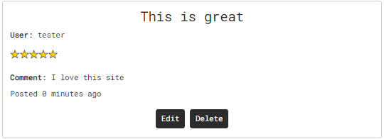

# Knockout Embroidery  
This project is the development of an e-commerce web application for Knockout Embroidery, a company specializing in embroidered clothing and personalized products. The platform is designed to offer a seamless online shopping experience, showcasing a variety of embroidery items and enabling users to make purchases directly through the site.  

This is Milestone Project 4 for a Level 5 Diploma in Web Application Development.    

  

Link to live site: [Knockout Embroidery](https://knockout-embroidery-32949738fa37.herokuapp.com/products/)

## CONTENTS

* [User Experience](#user-experience-ux)
  * [User Stories](#user-stories)

* [Design](#design)
  * [Colour Scheme](#colour-scheme)
  * [Typography](#typography)
  * [Layout](#layout)
  * [Imagery](#imagery)
  * [Wireframes](#wireframes)
  * [Data Model](#data-model)
  * [Security](#security)
  * [Future Updates](#future-updates)

* [Features](#features)
  * [Future Implementations](#future-implementations)
  * [Accessibility](#accessibility)

* [Technologies Used](#technologies-used)
  * [Languages Used](#languages-used)
  * [Frameworks, Libraries & Programs Used](#frameworks-libraries--programs-used)

* [Testing](#testing)

* [Deployment](#deployment)

* [Credits](#credits)
  * [Code Used](#code-used)
  * [Content](#content)
  * [Media](#media)
  * [Acknowledgments](#acknowledgments)
  
  ---

## User Experience (UX)  

### User Stories

**User Story 1:**  
First time customer - I want to easily navigate the website and understand the services offered, So that I can find the embroidery products I need without confusion and make my first purchase smoothly.  

**User Story 2:**  
Returning customer - I want to log in to my account and view my previous orders, So that I can reorder products I liked or track the status of my current orders.  

**User Story 3:**  
Embroidery collector - I want to be able to search and filter products based on specific criteria like material, style, and artist, So that I can find unique and high-quality pieces to add to my collection.  

**User Story 4:**  
Business owner - I want users to be abvle to access my site, I want it to have a simplistic look and feel to it.  


| As a/an | I want my customers to be able to... | So that they can... |
| ----------- | ----------- | ----------- |
| Navigation  | 
| Business owner | Navigate the sit easily using navbar | Move between different pages with ease | 
| Business owner | View products availabe | Find out further information about and see further images of the listing | 
| Business owner | View their order history | Plan my journey to the site from my location | 
| Registration and User Accounts | 
| Business owner | Easily register for an account | Have a personal account and be able to see their profile | 
| Business owner | Easily login or logout | Access their personal info | 
| Business owner | Easily access their user profile | Access their account quickly | 
| Business owner | Have a personalised user profile | With their personal order history and be able to update their default delivery address | 
| Purchasing and Checkout | 
| Business owner | Add to basket and checkout without registering | Use the site less if they feel to | 
| Business owner | Be able to see that their basket has items in from any page | So that they can keep track of their basket | 
| Business owner | Receive prompts when items are added to their basket | immediately see if the products that they have purchased are in their basket | 
| Business owner| Easily enter their payment information | Check out quickly with no hassles | 
| Business owner | Recieve an email confirmation after checkout | Keep the information for their own records | 
| Products Page | 
| Business owner | Choose a location where embroidery is located | Have accuracy over where the customising is on their product | 
| Business owner | Add customised text to the product they are purchasing | Easily purchase a customisable item | 
| Business owner  | Select different sizes of products | purchase for a wider audience | 
| Business owner  | Select different colours of products | purchase for a more reasons | 
| Ratings & Reviews | 
| Business owner  | add a Review | promote the site in a positive light | 
| Business owner  | edit a Review  | In case they wish to edit a review | 
| Business owner  | delete a review | In case they wish to edit a review | 

## Design  

### Colour Scheme

Initial colour scheme is general dark theme for a contemporary look, I have included navy blue and white as accent colours which will also provide good accessibility scores.  


### Typography

The font used throughout the site is 'Roboto Mono', I have chosen this font because I consider it to be clean and easy to read.  

### Layout

The layout of the Suport website is built using the Bootstrap framework, which provides a responsive grid system that allows the website to adapt to different screen sizes and devices. The use of a grid system helps to create a consistent layout on necessary pages of the website, which makes navigation and exploration more intuitive for visitors.  

### Accessibility  

Image alt, aria labels, colour contrast.  
**more content**
 

### Imagery  
Used a combination of imagery from Pixabay (See media below) and images from Knockout Embroidery business, I have business owners permission to use the imagery. Images are all of a similar size and quality for consistency throughout the site.

### Wireframes
[Knockout Embroidery Wireframe](README-images/knockout-embroidery-wireframes.pdf "Link to project wireframe")  
There have been some changes since the wireframe was created. The initial plan for the site was The 'About us' and 'Contact' pages to be separate but i merged them because i didn't think it was necessary for there to be two pages. The general principle remains the same throughout the site.

### Data Model  

See database schema [here](README-images/db-schema.pdf "Link to database schema")  

The following datbase models were used;  
Orders -  used to store users oreder information.  
Order line items -  used to handle order infromation in basket.  
Products -  Used to add information about products on site.  
Users -  Used in user registration.  
Contacts -  Used for customer contact form.  
Profiles -  Used to enable users to access order history and update default deilvery information.  
Reviews -  Used for users to add reviews on the site.  

### Security    

A number of different security considerations were taken into account when putting together this project.    

**Use of .env file**  
Important credentials including DATABASE_URL, SECRET_KEY, STRIPE keys, AWS ACCESS KEYS and GMAIL passwords are located within .env file which is subsequently in a .gitignore file to ensure it remains secure. SECRET_KEY was initially located in settings.py file, it has since been changed and moved to a more secure location in .env file, the database was also subsequently destroyed and rebuilt to produce a different DATABASE_URL.  

**Defensive Programming**  
Measures have been put in place throughout the site to prevent users from doing things they are not authorised to do. For example, Users can only access the product admin panel if they are superusers. Users can not access the profile page unless they are authenticated and can also not add reviews.  

**Feedback to Users**  
Toast messages provide feedback to users about the status of their actions. For example, 'successful login or reasons for authentication failure'.  


## Features

### General features  

**Sign up/login**  
Users have the ability to sign up, using Djangos built in authenticaton process.  

  

**Navbar**  
The navbar is made up of icons that display the page title on hover, The 'basket' icon will be white when empty and gold when there is an item in the basket.  

  

**Home page**   
Users are presented with some textual information about the business. The page includes interactive images of 5 images that are examples of historic customer orders. When users hover over the images, they expand causing more of the image to be visible, leading to a better user experience. This is hidden on smaller screens and replaced with an image carousel.  

  

**Image Carousel**   
A Bootstrap image carousel was used on individual sports pages to enhance user experience.  

  

**Products page**  
Products landing page that includes all products currently availabe for purchase. Superusers can edit/delete products available for purchase here, styled using bootstrap to handle responsiveness.  

  

**Product details page**  
Page for each indivdual product, users have the option to customise the product they are purchasing. They can change the size, colour, embroidery location, embroidery text and quantity. Users have the option to 'add to basket' or 'keep shopping'.  

  

**Profile page**  
Users are presnted with an option to update default delivery information and view their order history. Page is styled using bootstrap to handle responsiveness.  

  

**Product admin page**  
Superusers can add products here, They can choose a name, price, description, stock and sku as well as adding an image.  

  

**Review page**  
Users can add a review here if they are authenticated. If they are not, they are presented with an option to register or login.  

  


**Add a review page**  
This page is only accessible to users that are authenticated. Users have the option to add a review for the site. The review consists of a review title, review comment and star rating. Users are displayed with a 'submit review' and 'Back to products' buttons.   

  

**About us page**  
This page presents customers with more information about the business, including a spinning logo added to improve user experience. There is also a contact form for users to reach out with alternative contact information also present on the page.  

  
  

**Basket**  
The basket allows users to view items in their basket. They can see all aspects of there order. I have included a 'view embroidery text' modal because when there was large amount of text, it was difficult to handle on the one page. Users can also change the quantity of product by using append and prepend buttons and updating the order, users can also remove items from their basket here.  

  

**Checkout**  
Users are presented with details, delivery input boxes and an order summary, They input their personal information and card details underneath. Users can adjust bag or complete order using 'Adjust bag' and 'complete order' buttons. Users will recieve an email confirmation when the order is placed.  

  

**Checkout Success**  
Users are presented with a 'Thankyou' message and information about their order including order details, delivery info and billing information.  

   

**Logout**  
Users can logout using the icon in the navbar.  

**Footer**   
Users can navigate to respective social media sites that are present in the footer. On non-touchscreen devices, an animation has been added causing the icons to rotate utilising SVG.  

  
 
**Toast messages**  
Toast messages have been added to prompt users when siginificant actions are taken on the site such as adding to bag, adding review, registering and logging in. Toast messages have also been set up to handle errors.  

 


### Future Implementations  
There are a number of different features I would add if i had more time;  
- Give users option to upload logo.  
- Add categories page to separate products rather than one big 'products' page.
- Add wishlist to users profile, giving users option to add items they wish to purchase.
- Newsletter subscription to keep customers up to date with the business.  


## Technologies Used

### Languages Used

**HTML5**  
Used for creation of markup for the website content.  
**CSS**  
Cascading style sheets used to style the individual pages.  
**Javascript**  
Used to toggle visibility of certain aspects of the site.  
**Python**  
Used to run the app.  


### Frameworks, Libraries & Programs Used

[Django 5.0](https://www.djangoproject.com/)  
Used as the backbone of the project for robust data handling, templating, and routing.  

[Bootstrap 5.2.3](https://getbootstrap.com/)  
Boostrap was predominantly used throughout the site for responsiveness, modal and image carousel.  

[jQuery](https://jquery.com/)  
I used jQuery to add functionality to Bootstrap components and within my scripts.

[CDN jsdelivr](https://www.jsdelivr.com/)  
CDN jsdeliver was used to serve static assets bootstrap and jquery to improve performance and reliability.

[Google Fonts](https://fonts.google.com/)  
Used to import 'Roboto Mono' font.  

[Font awesome](https://fontawesome.com/)  
Used to import icons on to the site to improve user experience.  

[Github](https://github.com/)   
GitHub is used to store the projects code after being pushed from Git.  

[Balsamiq](https:/balsamiq.com)  
Balsamiq was used to create the wireframes during the design process.  

[Heroku](https://id.heroku.com/login)  
Used to deploy the project.  

[AWS](https://aws.amazon.com/)  
Used to store static files and media for deployed project.  

[Stripe](https://stripe.com/gb)  
Used to handle payments securely on site.  

[PostgreSQL](https://www.postgresql.org/)  
Hosted the database used in my project.  

[Visual Studio Code](https://code.visualstudio.com/download)  
Visual Studio Code was use to create files pages and where i produced the code for the project.  

[Google Chrome Dev Tools](https://developer.chrome.com/docs/devtools/)    
Google Chrome Dev Tools was used during the testing phase to test the responsiveness of the site and to check for any bugs.
 
[W3schools](https://www.w3schools.com/)    
W3schools was used as a guide for HTML, CSS and Python basic principles.  

[dbdiagram](https://dbdiagram.io/)  
Used to mock up database structure diagram.


## Testing  
Testing process can be found [here](https://github.com/ojalaw/knockout-embroidery-MP4/blob/main/TESTING.md) 


## Deployment

**How was this site deployed?**

The website was initially deployed on Heroku.

**Deploying on Heroku**  
The following steps will need to be taken to deploy the application using Heroku.

- Create a requirements.txt file.  
- Create a Procfile by typing echo web: python app.py > Procfile. Ensure it starts with a capital P.  
- Go to Heroku. Log in or create an account.  
- Click the 'New' button and click 'Create new app'.  
- Enter a unique name for your project with no capital letters or spaces and select your region. Click 'Create App'.  
- Inside your project, go to the Resources tab and create a Heroku Postgres Database.  
- Inside your project, go to the 'Settings' tab. Scroll down and click 'Reveal Config Vars'.  
- Add in the following variables.
   - SECRET_KEY : Your secret key
   - DATABASE_URL: your postgres database URL
   - STRIPE_PUBLIC_KEY: Your Stripe public key
   - STRIPE_SECRET_KEY: Your stripe secret key
   - USE_AWS: set to 'True'
   - AWS_ACCESS_KEY_ID: Add sccess key ID
   - AWS_SECRET_ACCESS_KEY: Add secret access key.
   - GMAIL_PASSWORD: Add Gmail password from selected account for email confirmation.  
- Deploy your project by going to the Deploy tab and choose 'Connect to Github'
- Find your repository name and select Connect.

**Create a new repository on GitHub**  
- Add the necessary files to the repository.
- Go to the settings page of the repository, located on the menu bar towards the top of the page, scroll down to the GitHub Pages section which is located at the bottom of the 'Code and automation' sub-section.
- Select the main branch and the root folder, then click save.
- The website will now be live at the URL provided in the GitHub Pages section.

**How to clone the repository**

- Go to the (https://github.com/ojalaw/knockout-embroidery-MP4)  repository on GitHub.
- Click the "Code" button to the right of the screen, click HTTPs and copy the link there.
- Open a GitBash terminal and navigate to the directory where you want to locate the clone.
- On the command line, type "git clone" then paste in the copied url and press the Enter key to begin the clone process.  

**How to Fork the repository**  

- Go to the https://github.com/ojalaw/knockout-embroidery-MP4 repository on GitHub.
- Click on the 'Fork' option towards the top left of the page.  
- Click the dropdown button and click 'create a new fork'.  
- This will bring up a page with details of the repository, fill in boxes as required.
- Click 'create fork'.  

For further guidance [click here](https://docs.github.com/en/get-started/quickstart/fork-a-repo)  

Forking this repository will allow changes to be made without affecting the original repository.  

### AWS Connection  

For the use of AWS S3  buckets, I followed guidance from Code Institute learning material, this can be achieved by following the steps below.  

### Creating a S3 Bucket

- You will need to create an AWS account if you don't already have one
- Go to your AWS account, and go to 'S3'
- Click create a new bucket. Uncheck block all public access and set the Object Ownership settig with ACLs enabled. Click Create Bucket
- On the properties tab, scroll down to 'static website hosting' and 'use this bucket to host a website'. Set the home/default page to 'index.html' and error link as 'error.html', then save.
- On the permissions tab, go to 'CORS configuration' and copy in the below.
``` 
[
   {
   "AllowedHeaders": [
   "Authorization"
   ],
   "AllowedMethods": [
   "GET"
   ],
   "AllowedOrigins": [
   "*"
   ],
   "ExposeHeaders": []
   }
   ]
```
- On the permissions tab, go to Bucket Policy and copy the ARN.
- Select generate policy. Select S3 Bucket Policy under policy type. Enter * for all Principals, and the action will be GetObject. Paste in the copied ARN into the ARN field.
- Click add statement then generate policy, and copy this policy into the Bucket policy editor.
- Before you press save, enter a star after the slash in Resource to allow access to all resources in this bucket. Click save.
- Go to the Access control list (ACL) tab, click edit and enable List for Everyone under the public access section.

### Setting up IAM

- Go to your AWS account, and go to IAM
- Click groups and create a new group. Call it something like manage-your-site-name.
- Go to Policy and create policy. Go to the JSON tab and select import managed policy.
- In the dialogue box, search for S3 and import the S3 Full Access Policy.
- Get the ARN from your S3 bucket and paste it into the resources with and without the trailing *. It should look like this:
```
"RESOURCE": [
   "arn:aws....",
   "arn:aws..../*",
]
```
- Click review policy. Give it a name and description. Click create policy.
- Go back to groups and click your group to manage it. Go to the permissions tab, open Add Permissions and click Attach Policy. Search for your policy by it's name and select it. Click Add Permissions.
- Go to Users and click Add User. Name your user something like your-site-name-static-files-user. Give them programmatic access. Select next.
- Add the user to your group. Click through to the end and click Create User.
- Download the CSV to get the users access key and secret access key. Ensure you download it now, because you won't be able to access it again.

## Credits

### Code Used  

- Code institute learning material Boutique Ado walkthrough.  
- [Django documentation](https://docs.djangoproject.com/en/5.0/)  
- [Stripe Documentation](https://stripe.com/docs/payments)  
- [Corey Schafer Django Tutorial](https://www.youtube.com/watch?v=UmljXZIypDc&list=PL-osiE80TeTtoQCKZ03TU5fNfx2UY6U4p)  


### Content


###  Media

I used Images from Pixabay for the items currently on the product page.  

**Images**  

tshirt - https://pixabay.com/photos/t-shirt-white-clothes-rags-empty-1278404/ - versionFrancaise  
polo - https://pixabay.com/photos/adult-casual-caucasian-glasses-1851571/ - Pexel  
hoodie - https://pixabay.com/photos/portrait-male-young-hoodie-1236732/ - GG_BenQ_Gambit  
jumper - https://pixabay.com/photos/stomach-pain-man-jeans-sweater-2821941/ - Derneuemann  
hat - https://pixabay.com/photos/fashion-model-woman-young-woman-1844724/ - Pexels  
shorts - https://pixabay.com/photos/clothes-fashion-studio-1838144/ - Engin akyurt  

Other images were used in the site, taken from [Knockout Embroidery](https://www.knockoutembroidery.co.uk/) with the owners permission.  

**Site Content**  

Some of the text within the site is very similar to what is present on [Knockout Embroidery](https://www.knockoutembroidery.co.uk/). This site is going to replace the current website that the business uses.  

  
###  Acknowledgments  

Code Institute mentors  
- Chris Quinn  
- Daisy Mc Girr  
 
