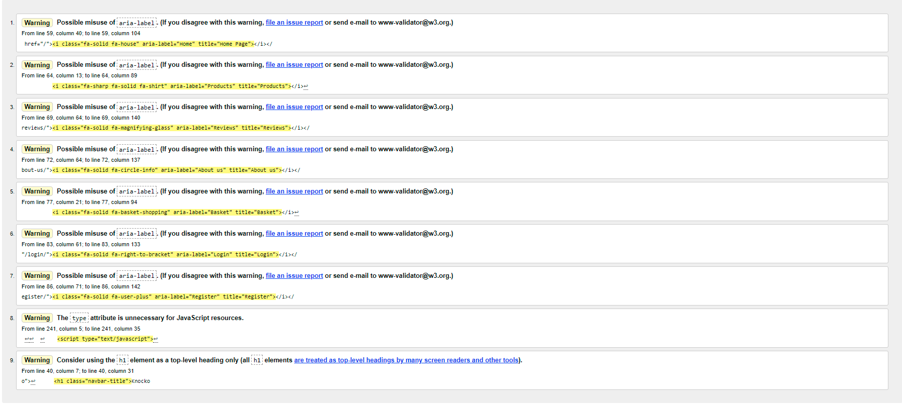
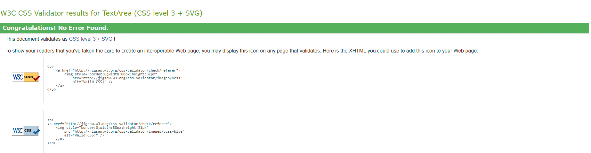
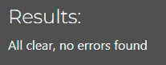

# Testing

## Contents

This site has been tested using the following testing procedures

* [Code Validation](#Code-validation)  

* [Lighthouse Testing](#Lighthouse-Testing)

* [Browser Compatibility](#Browser-Compatibility)

* [Manual Testing](#Manual-Testing)

* [Bug Reporting](#Bug-Reporting)

## Code Validation    

The site has been run through [W3C](https://validator.w3.org/), [WC3 CSS](https://jigsaw.w3.org/css-validator/), [JSHint](https://www.jshint.com/) javascript validator and CI [PEP8 validator](https://pep8ci.herokuapp.com/) 

**HTML** 

  

- No errors were present during validation.  
- 9 Warnings were present, 7 of which were aria label errors in navbar.
   
**CSS**  

  

- No errors were present during validation.  
- 16 errors present in bootstrap CSS but no errors in base.css.  

**Javascript**  

There were no errors when running javascript file through JShint validator.  

**Python**  

I had to correct some errors regarding characters exceeding 79 and 2 lines not present between dunctions. There are no errors when running python files through pep8 validator, There were also no errors present in the terminal or console.  

## Lighthouse Testing  

All pages passed lighthouse testing scoring particularly highly throughout.  

**Home**  
Desktop lighthouse score [here](README-images/light-home-desktop.png "Optional title")  

Mobile lighthouse score [here](README-images/light-home-mobile.png "Optional title")  

**Products**  
Desktop lighthouse score [here](README-images/light-products-desktop.png "Optional title")  

Mobile lighthouse score [here](README-images/light-products-mobile.png "Optional title")  

**Product detail**  
Desktop lighthouse score [here](README-images/light-product-detail-desktop.png "Optional title")  

Mobile lighthouse score [here](README-images/light-product-detail-mobile.png "Optional title") 

**Reviews**  
Desktop lighthouse score [here](README-images/light-reviews-desktop.png "Optional title")  

Mobile lighthouse score [here](README-images/light-reviews-mobile.png "Optional title") 

**About us**  
Desktop lighthouse score [here](README-images/light-about-desktop.png "Optional title")  

Mobile lighthouse score [here](README-images/light-about-mobile.png "Optional title")  

**Basket**  
Desktop lighthouse score [here](README-images/light-basket-desktop.png "Optional title")  

Mobile lighthouse score [here](README-images/light-basket-mobile.png "Optional title")  

**Login Required pages**  

**Profile**
Desktop lighthouse score [here](README-images/light-profile-desktop.png "Optional title")  

Mobile lighthouse score [here](README-images/light-profile-mobile.png "Optional title")  

**Product Admin**  
Desktop lighthouse score [here](README-images/light-product-admin-desktop.png "Optional title")  

Mobile lighthouse score [here](README-images/light-product-admin-mobile.png "Optional title")  

## Browser Compatibility 
  
**Desktop**  

| Browser            | Version                                               | Bugs  |
| -------------      |:-------------:                                        | -----:|
| Google Chrome      | Version 112.0.5615.138 (Official Build) (64-bit)      | None  |
| Microsoft Edge     | Version 112.0.1722.58 (Official build) (64-bit)       | None  |
| Firefox            | 112.0.1 (64-bit)                                      | None  |  

**Mobile**  

| Device                   | Operating system | Bugs  |
| -------------            |:-------------:   | -----:|
| iPhone 14                | iOS 16.6.1       | None  |
| iPhone 14 pro            | iOS 16.6.1       | None  |
| iPad 10                  | iOS 16.6         | None  |
| Samsung Galaxy S22 ultra | Android 14.0     | None  |
| HONOR Magic5 Pro         | Android 13.0     | None  |
| iPhone 13 pro            | iOS 16.6         | None  |

## Manual Testing  

During the manual testing, I tested the sites functionality, usability and responsiveness.  

#### Functionality

| Test                                          | action                                                                | expected                                                    | Result |
| --------------------------------------------- | --------------------------------------------------------------------- | ----------------------------------------------------------- | ------ |
| Test navbar links                             | Click each navbar link                                                | To move between the different pages                         | PASS   |
| Interactive image gallery                     | Hover over images with mouse                                          | Image expands on hover                                      | PASS   |
| Browse products button                        | Click browse products button                                          | to be take to the products page                             | PASS   |
| Profile                                       |                                                                       |                                                             |        |
| Update Default delivery information           | Enter different delivery infromation                                  | The information to update                                   | PASS   |
| Access order History                          | Click order history                                                   | to be displayed with a previous order history               | PASS   |
| Country dropdown/Django countries             | Select different country using the dropdown                           | to be able to select country using dropdown                 | PASS   |
| Products                                      |                                                                       |                                                             |        |
| Images have border on hover                   | Hover over image with cursor                                          | Image to have black border on hover                         | PASS   |
| Page to be responsive                         | Change screen size                                                    | Content to be responsive and adapt depending on screen size | PASS   |
| Edit and delete buttons                       | click edit/delete button                                              | products were edited/deleted aaccordingly                   | PASS   |
| Toast messages                                | Added item to basket                                                  | Toast message to display item in basket                     | PASS   |
| Product details                               |                                                                       |                                                             |        |
| Customising product prior to adding to basket | Changed size, colour, embroidery details                              | to have the ability to change customisable products         | PASS   |
| Buttons                                       | Keep shopping clicked                                                 | to be taken to products page                                | PASS   |
| Buttons                                       | Add to basket button clicked                                          | Items to be added to basket                                 | PASS   |
| Superuser options                             | click edit/delete button                                              | Buttons work accordingly                                    | PASS   |
| Reviews                                       |                                                                       |                                                             |        |
| Add review button                             | Clicked add review button                                             | Taken to 'Add review' page                                  | PASS   |
| Review container                              | Click add review                                                      | Title, comment and rating options appear                    | PASS   |
| Edit Review                                   | Click edit review button                                              | Title, comment and rating to be editable                    | PASS   |
| Error handling regarding character limit      | Add more than the allowed characters                                  | Toast message error                                         | PASS   |
| Time display                                  | Add a review                                                          | Time is displayed as 'time ago' rather than actual date.    | PASS   |
| About                                         |                                                                       |                                                             |        |
| Rotating logo                                 | Access about page                                                     | does logo appear spinning slowly                            | PASS   |
| Contact us form                               | Fill in contact form and submit                                       | to be able to fill form in                                  | PASS   |
| Send message button                           | Click send message after contact form filled in                       | Contact form to submit                                      | PASS   |
| Basket                                        |                                                                       |                                                             |        |
| Basket display                                | Product added to basket                                               | Product is present in basket                                | PASS   |
| View embroidery text modal                    | Click 'view embroidery text'                                          | Text is present in modal                                    | PASS   |
| Quantity buttons                              | Click '-' and '+' buttons                                             | quantity changes accordingly                                | PASS   |
| Update/remove buttons                         | click update/delete                                                   | Item is deleted from basket/quantity updated                | PASS   |
| checkout                                      |                                                                       |                                                             |        |
| User details                                  | Fill In user details forms                                            | User details to be displayed                                | PASS   |
| Delivery details                              | Fill in delivery details                                              | delivery details to be displayed                            | PASS   |
| Payment details                               | Fill in payment details                                               | Payment details to be displayed                             | PASS   |
| Order Summary                                 | view product in checkout                                              | Product to be present                                       | PASS   |
| Checkout Success                              |                                                                       |                                                             |        |
| Thankyou message                              | Complete order                                                        | Thankyou message displayed                                  | PASS   |
| Order info                                    | Order info is displayed                                               | To be dable to see order info                               | PASS   |
| Toast messages                                | Toast message confirms order and notifies user of confirmation emails | To see toast message                                        | PASS   |
| Confirmation email                            | Complete checkout                                                     | To receive confirmation email                               | PASS   |

**Usability**  

During testing;

- some users felt that the image carousel would be better on smaller devices instead of the interactive images.
- It was noted that the collapsible navbar wasnt very clear and needed to be a lighter colour.
- Some users felt that the collapsible navbar needed titles instead of just icons.
- Some users felt that the stars on the review page needed a background colour to enhance colour contrast.  

**Responsiveness**  

I used the following break points for responsiveness.  

- 500px  
- 768px  
- 992px
- 1090px
- 1264px
- 1492px

Generic bootstrap breakpoints were also used throughout the site.  

## Bug Reporting
Throughout the development phase of the site, I came across a variety of different bugs/errors that eventually overcame.  

**Resolved**  
-	static files temporary fix followed by permanent fix, I added disable static to config vars. However, the introduction of AWS S3 bucket was more of a permanent solution.  
-	import issue with home.views
-	Allowed hosts added for local testing
-	Css folder not registering causing console error
-	404 error when logging user in
-	Application error when logging in user/superuser, hadn’t migrate local database.
-	Heroku migrations error

**Unresolved**  

- Sometimes on apple mobile devices, 'view text embroidery' modal cannot be closed and the page needs to be refreshed instead.
- Stars display from right to left when viewed on reviews.html and when editing. This was not initally planned but still displays the correct rating.

[Back to README.md](https://github.com/ojalaw/knockout-embroidery-MP4/blob/main/README.md)
